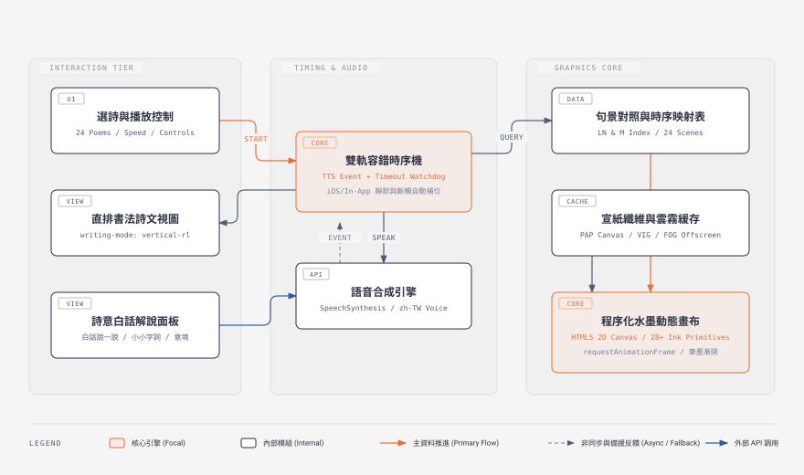

# 我愛讀詩・水墨動畫

打開瀏覽器，點擊任一首詩，右側會直排浮現書法詩句，左側畫布則隨朗讀聲一筆筆化開山水與人物。

這是一個單一檔案、零外部依賴的古典詩詞學習網頁。整套專案只有一個七十多 KB 的 `index.html`，不需要安裝 Node 套件，也不用架設後端伺服器，按兩下就能在電腦或手機瀏覽器跑起來。

## 這個專案在做什麼

小學語文教材收錄了許多唐宋經典詩詞。單純背誦文字往往枯燥，如果直接放外包錄製的影片檔，檔案動輒數十 MB，低頻寬時載入緩慢，而且詩句與畫面很難做到隨點隨讀的動態互動。

這個專案嘗試用純前端程式碼解決這件事。二十四首選詩按上下學期編排，每首詩都配有專屬的水墨動態意境。畫面上的一草一木、遠山近水、孤舟與人物，全由 HTML5 Canvas 2D 貝茲曲線與漸層色即時算出來。使用者除了看著畫面聽整首詩唱詠，也可以隨時點選右側的任何一句單獨重聽，或是展開白話解說查看字詞釋義。

## 雙軌時序的由來

在瀏覽器做語音同步，最常踩到的坑在行動端。

桌面版 Chrome 或 Safari 對 Web Speech API 的事件回報相當精確，每個句子朗讀開始時會拋出 `onstart`，念完會拋出 `onend`。只要掛上監聽器，就能順理成章讓對應詩句亮起底色，並觸發那一幕的水墨元素淡入。

一旦換到 iPhone 上的 Safari，或者 Line、Facebook 內建瀏覽器，情況就完全變了。系統常在靜音狀態下吞掉語音事件，或是句子念到一半回報逾時，後續的事件直接消失。如果單純仰賴原生事件，整個動畫就會卡在第一句，再也動彈不得。

為了解決這個問題，程式裡做了一套雙軌容錯排程機制。

每一句發音送出前，系統會依據該句字數與當前語速，預先算好一個預期朗讀時長，並啟動備援計時器。如果瀏覽器如期傳回 `onstart` 事件，狀態機立刻推進，同時替下一句預約下一輪備援；若是原生事件遲遲沒有抵達，計時器會在容許邊界內直接接管，強制點亮詩句並把對應景物推入畫面。只要在畫面上點擊任何一行，語音佇列便會清空重新對齊，避免兩種訊號打架。

## 宣紙底紋與水墨圖元

專案裡的畫布解析度固定為一千五百乘九百像素。為了做出宣紙吸水散墨的質感，程式設計了三層背景緩存，只在開頁時繪製一次，後續每幀直接做影像貼合。

第一個緩存是在記憶體裡鋪上七千顆微小雜點與兩百多道隨機微彎墨絲，模擬生宣紙的纖維紋理。第二個緩存是四角的向心暗調漸層，製造出水墨畫卷的留白與暈邊。第三個緩存則是橫向無縫循環的動態雲霧，白天偏素米色，夜景偏冷灰藍。

畫布主循環採用二十八種程序化圖元，在 `E` 物件內以純數學幾何實作。

山巒由三次貝茲曲線勾勒山勢，以垂直線性漸層呈現墨色濃淡，山脊再補上不規則墨點；江河水波用多組正弦波交錯疊加，產生自然的漣漪律動；柳樹與松枝依重力與風動係數微幅搖擺；古裝人物則根據角色切換書生、老翁、仕女或將士的衣冠細節，甚至在長征詩篇裡畫出披甲戰馬與長城關隘。

透過每首詩專屬的景物陣列與語句索引矩陣，每個視覺元素都知道自己該在第幾句唱詠時出場，以三次多項式曲線平滑淡入，達到詩畫互映的效果。

## 收錄詩目

專案一共收錄二十四首經典篇章。

上學期十二首。賀知章〈回鄉偶書〉、張繼〈楓橋夜泊〉、杜牧〈秋夕〉、王維〈九月九日憶山東兄弟〉、朱熹〈偶成〉、李白〈送孟浩然之廣陵〉、王昌齡〈出塞〉、杜秋娘〈金縷衣〉、朱熹〈觀書有感〉、王翰〈涼州詞〉、張旭〈桃花谿〉、孟郊〈遊子吟〉。

下學期十二首。李白〈獨坐敬亭山〉、蘇軾〈題西林壁〉、王之渙〈涼州詞〉、太上隱者〈答人〉、李白〈怨情〉、杜牧〈贈別〉、趙翼〈論詩〉、杜牧〈清明〉、李商隱〈夜雨寄北〉、李白〈月下獨酌〉、韋莊〈金陵圖〉、顏真卿〈勸學〉。

## 白話解說模組

每首詩都備有獨立的輔助教學資料庫。點擊控制列上的解說按鈕，會展開三欄式卡片。

第一欄「白話說一說」用淺顯口吻把全詩故事娓娓道來。第二欄「小小字詞」拆解生難字與古代名物。第三欄「記住這句」提煉出最核心的名句與意境。

解說區具備專屬的語音功能。系統會將三段文字依序轉為流暢語句，並在朗讀到該區塊時以柔和淡紅底色同步追蹤，念完自動收工。

## 本地使用與操作方式

不需要編譯或安裝任何環境。

用現代瀏覽器直接開啟專案根目錄下的 `index.html` 即可。

按鍵與介面支援鍵盤與觸控。

- 方向鍵左鍵或點選按鈕，切換到上一首詩。
- 方向鍵右鍵或點選按鈕，切換到下一首詩。
- 點選上方或下方導覽列的詩名，直接跳轉。
- 點選右側直排詩句，單句重播語音並重新聚焦該句動畫。
- 點選朗讀或停止按鈕，控制語音播放。
- 透過下拉選單調整慢、適中、快三種語速。
- 支援行動裝置直式畫面、平板雙欄橫排與手機橫向滿版適配。
